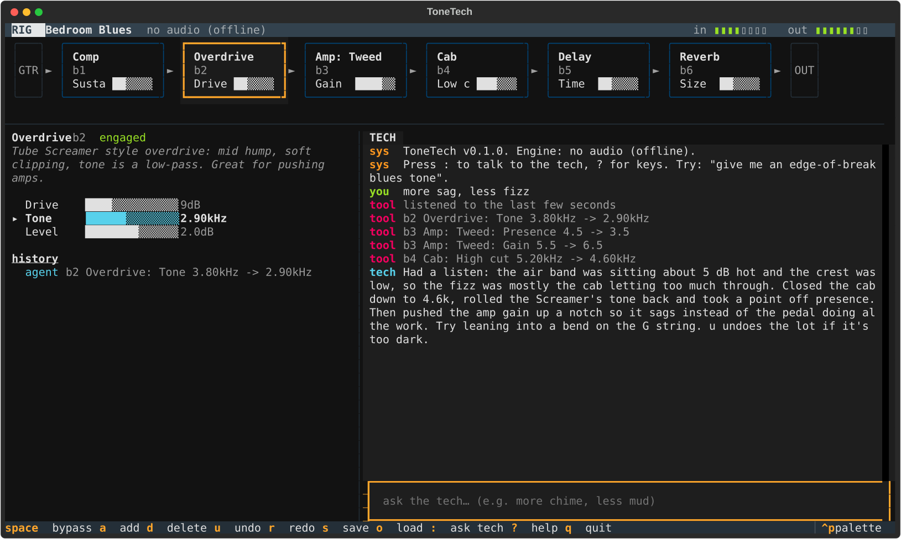
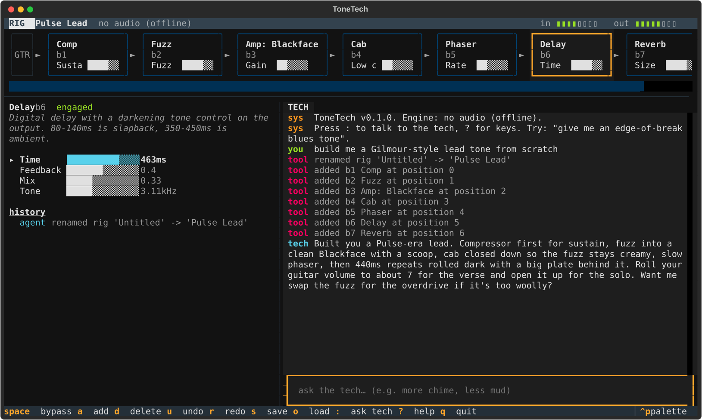
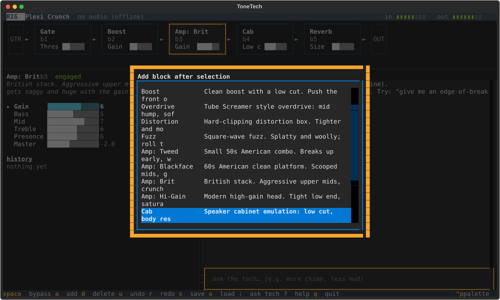

<h1 align="center">ToneTech</h1>

<p align="center">
  An agent-driven terminal pedalboard for guitar.<br>
  Real-time effects in your terminal, with a Claude tone tech in the side pane who turns the knobs for you.
</p>

<p align="center">
  
</p>

---

Plug your guitar into an audio interface, run `tonetech`, and play. The top of the screen is your signal chain. The left pane is the knobs of whichever block is selected. The right pane is the **tech**: you type in guitarist words ("more sag, less fizz", "build me a Gilmour lead tone", "why is this boxy?") and the tech edits the chain. Every change lands in the history as a diff and `u` undoes it.

The tech never touches audio directly. It emits small, validated patch operations that the same engine applies whether the change came from the model or from your keyboard. That keeps latency, safety and undo in plain code, and makes every move the agent makes reviewable.

## Features

- **Live signal chain** built on [Spotify's pedalboard](https://github.com/spotify/pedalboard): compressor, gate, boost, Tube Screamer style overdrive, distortion, fuzz, four amp voicings, cab emulation, EQ, chorus, phaser, delay and reverb.
- **A tone tech that listens.** Ask for a feel rather than a knob and the agent calls `analyze_input`, looks at the spectrum and dynamics of what is actually coming out of the chain, and grounds its changes in the measurement.
- **Everything is a patch.** Agent edits and keyboard edits go through the same `apply_patch`, so they share one undo stack, one history log and one validation path. A bad op in a batch rejects the whole batch.
- **Keyboard first.** Vim-ish navigation across blocks and knobs, one-key bypass, add, delete, reorder, undo, redo, save, load.
- **Rig library** with five factory presets and JSON rigs saved in `~/.tonetech/rigs`.
- **Runs without audio.** `--no-audio` uses an offline engine that synthesises a test signal, which is also what the tests and screenshots use.

<p align="center">
  
</p>

## Install

Requires Python 3.10+ and an audio input device. macOS and Linux are tested; Windows should work but has not been tried.

```bash
# with uv (recommended)
uv tool install git+https://github.com/Techblogogy/tonetech

# or with pipx
pipx install git+https://github.com/Techblogogy/tonetech

# or from a clone, for hacking
git clone https://github.com/Techblogogy/tonetech && cd tonetech
uv venv && uv pip install -e ".[dev]"
```

The tech needs an Anthropic API key. Set `ANTHROPIC_API_KEY` in your environment, or log in once with the `ant` CLI and the SDK picks the profile up. Without credentials the board still works; only the chat pane is disabled.

## Quick start

```bash
tonetech --devices            # find your interface
tonetech --input "Scarlett 2i2" --output "Scarlett 2i2"
```

Then press `:` and type something:

> give me an edge-of-breakup blues tone with a bit of slap

> it's too fizzy on the high strings

> swap the overdrive for a fuzz and push the amp harder

> why does the compressor go before the drive?

The tech replies like someone leaning over your amp: what it changed, why, and one thing to try playing. Big moves come with a reminder that `u` puts everything back.

Useful flags:

| Flag | What it does |
| --- | --- |
| `--rig "Plexi Crunch"` | Start from a saved rig or factory preset |
| `--empty` | Start with an empty chain and let the tech build one |
| `--buffer 128` | Lower latency, more CPU (default 256) |
| `--rate 44100` | Match your interface's sample rate (default 48000) |
| `--no-audio` | Offline engine, no devices touched |
| `--presets` | List factory presets |

## Keys

| Key | Action |
| --- | --- |
| `j` `k` or `◄` `►` | Select previous / next block |
| `▲` `▼` | Select knob |
| `h` `l` | Turn knob down / up (`H` `L` for coarse steps) |
| `space` | Bypass / engage block |
| `a` | Add a block after the selection |
| `d` | Delete block |
| `[` `]` | Move block left / right |
| `u` `r` | Undo / redo (agent and keyboard edits share one stack) |
| `s` `o` | Save / load a rig |
| `:` or `i` | Focus the tech's input |
| `esc` | Back to the board |
| `?` | Key help |
| `q` | Quit |

<p align="center">
  
</p>

## How it works

```
 keyboard ──┐                                ┌── AudioEngine (worker thread)
            ├──► RigState.patch(ops) ──► Rig ─┤     read ► Pedalboard ► write
 tech ──────┘         │                       └── meters + capture ring
   ▲                  ▼
   │            undo / history
   └── tools: get_rig · apply_patch · analyze_input · save_rig · load_rig · list_rigs
```

- **`rig.py`** holds the data model. A `Rig` is an ordered list of `Block`s, each with a kind and a dict of knobs normalised to 0..1. `apply_patch` takes ops like `{"op": "set", "block": "b2", "param": "tone", "real": 2800}` and returns human-readable change lines. `RigState` wraps that with undo, redo, coalesced knob nudges and change notifications.
- **`catalog.py`** maps each block kind to a list of pedalboard plugins and a `settings()` function that turns knob values into plugin parameters. Building a block and live-updating it use the same function, so they can never disagree. Amp voicings are one builder with a voicing table.
- **`engine.py`** runs the audio loop: an input stream, the board, an output stream. Knob moves update plugin attributes in place; structural changes swap in a freshly built board at the next buffer. A limiter at the end of the chain keeps your monitors safe from the agent's experiments.
- **`analysis.py`** turns a few seconds of audio into RMS, crest factor, spectral centroid, seven band levels and words like *muddy*, *boxy*, *fizzy*, *scooped*, *compressed*.
- **`agent.py`** is a small manual tool-use loop on the Anthropic SDK (`claude-opus-5`, adaptive thinking, server-side refusal fallbacks enabled). The system prompt embeds the catalog, so the model only ever proposes kinds and parameters that exist. Tool errors go back to the model as `is_error` results rather than crashing the turn.
- **`app.py`** is the Textual UI. The agent runs in a worker thread and posts messages back; the board re-renders from `RigState` notifications no matter who made the change.

## Block catalog

| Kind | Category | Knobs |
| --- | --- | --- |
| `gate` | dynamics | thresh, release |
| `comp` | dynamics | sustain, attack, release, level |
| `boost` | drive | gain, tight |
| `od` | drive | drive, tone, level (Tube Screamer topology: mid hump, soft clip, low-pass tone) |
| `dist` | drive | gain, tone, level (hard clipping) |
| `fuzz` | drive | fuzz, tone, level |
| `amp_tweed` | amp | gain, bass, mid, treble, presence, master (early breakup, warm) |
| `amp_black` | amp | same (scooped clean platform) |
| `amp_brit` | amp | same (upper-mid crunch) |
| `amp_hi` | amp | same (tight modern high gain) |
| `cab` | cab | low cut, body, high cut |
| `eq` | eq | low, mid, mid freq, high |
| `chorus` | mod | rate, depth, mix |
| `phaser` | mod | rate, depth, feedback |
| `delay` | time | time, feedback, mix, tone |
| `reverb` | time | size, damping, mix, width |

Factory presets: **Bedroom Blues**, **Glassy Clean**, **Plexi Crunch**, **Comfortably Wet**, **Chug**.

## Latency and honesty about the DSP

The audio loop is Python calling into pedalboard's C++ per buffer. At 256 samples and 48 kHz that is about 11 ms of round trip on a MacBook with a class-compliant interface, which is fine for practice and writing and not what you want on a stage. `--buffer 128` helps if your machine keeps up.

The amps are filter-and-waveshaper models, not captures. They respond to your pick and volume knob the way you'd hope, and the tech can voice them convincingly, but they are not a Neural Amp Modeler profile. Loading VST3/AU plugins as blocks is on the roadmap precisely so you can drop one in.

## Roadmap

- [ ] VST3 / AU plugin blocks (pedalboard already loads them; needs a generic knob mapper)
- [ ] Impulse response cabs via `Convolution`
- [ ] Tremolo and a proper spring reverb
- [ ] MIDI out so the tech can drive a Helix / Quad Cortex instead of software
- [ ] Tap tempo and note-value delay times
- [ ] A/B compare between two rigs with one key

## Development

```bash
uv venv && uv pip install -e ".[dev]"
uv run pytest -q                         # 48 tests, all offline
PYTHONPATH=. uv run python scripts/screenshots.py   # regenerate docs/screenshots/*.svg
tonetech --no-audio                      # poke at the UI without an interface
```

The tests drive the real Textual app headlessly and run the real agent loop against a scripted fake client, so the tool contract is covered without an API key. The screenshots are produced the same way.

## License

MIT. See [LICENSE](LICENSE).
